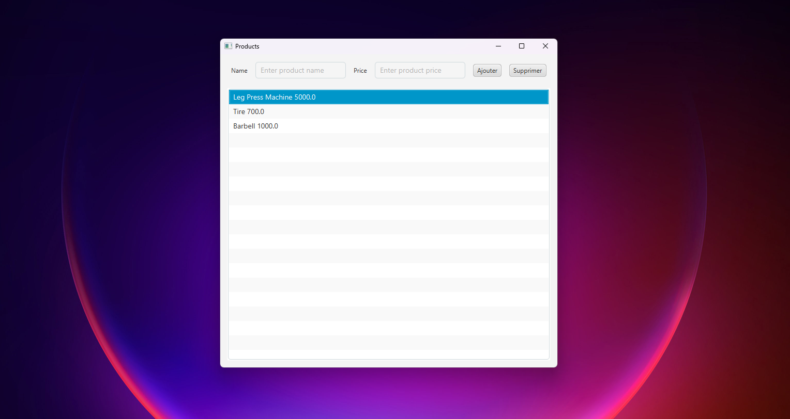

# Product Management - JavaFX Application

## Purpose

This application allows you to manage products using JavaFX. It provides a simple interface to add
products, display them in a list and interact with them.

---

## Features

- **Product Class**
  The Product class represents a product with two attributes: name and price. It includes constructors,
  getters, setters and a toString method to display the product information in a readable way.


- **Product-view View**
  The user interface consists of a form to add products and a ListView displaying the
  list of products. The view allows easy interaction with the data.


- **ProductController Controller**
  The ProductController controller handles user actions, such as adding new products to the
  list or updating existing information.


- **CSS Stylesheet**
  The application uses a CSS stylesheet to customize the appearance of the GUI, making
  the application more aesthetic and user-friendly.


- **Application Class**
  The main class of the application, which contains the start() method, is responsible for launching the application
  and initializing the user interface.

### Installation

- Clone this repository to your local machine:
```bash
git clone https://github.com/anasbrn/javafx-products-app.git
```
- Run the Application.java class to launch the application.

- Import the project into your favorite IDE (e.g. IntelliJ IDEA or Eclipse).

### Technologies used
- Java 17 or later
- JavaFX for GUI
- CSS for interface customization

### Screenshot


### Author
Anas BARNOCH, 2024